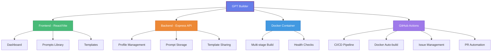

<div align="center">

# 🤖 GPT Builder

### Interactive Dashboard for Building Custom AI Models

[](https://github.com/cywf/gpt-builder/actions/workflows/ci.yml)
[](https://github.com/cywf/gpt-builder/actions/workflows/docker-build.yml)
[](LICENSE)
[](https://nodejs.org/)
[](https://www.docker.com/)
[](CONTRIBUTING.md)

<p align="center">
  <strong>Build • Architect • Export</strong><br>
  Create and manage custom AI model configurations with an intuitive interface
</p>

[Features](#-features) • [Quick Start](#-quick-start) • [Documentation](#-documentation) • [API](docs/API.md) • [Deployment](docs/DEPLOYMENT.md) • [Contributing](#-contributing)

</div>

---

## 📊 Repository Architecture



## ✨ Features

<table>
  <tr>
    <td width="50%">
      
### 🎨 Interactive Dashboard
- **Visual Model Builder** - Create AI models with an intuitive interface
- **Real-time Preview** - See your configurations in action
- **Drag & Drop** - Easy organization of prompts and templates
      
### 📝 Prompt Management
- **Store & Organize** - Keep all your prompts in one place
- **Categorization** - Tag and categorize for easy retrieval
- **Version Control** - Track changes to your prompts
      
    </td>
    <td width="50%">
      
### 🎭 System Instructions
- **Custom Behavior** - Define how your AI should respond
- **Temperature Control** - Fine-tune creativity vs. consistency
- **Token Management** - Control response length
      
### 🚀 Export & Share
- **GPT Profiles** - Export complete configurations
- **Template Library** - Share with the community
- **JSON Format** - Compatible with various AI platforms
      
    </td>
  </tr>
</table>

## 🏗️ Tech Stack

<div align="center">

| Frontend | Backend | DevOps | Tools |
|:--------:|:-------:|:------:|:-----:|
| React 19 | Node.js 20 | Docker | Vite |
| Vite | Express 5 | GitHub Actions | ESLint |
| Axios | File-based Storage | Docker Compose | Nodemon |

</div>

## 🚀 Quick Start

> **New to GPT Builder?** Check out our [Quick Start Guide](docs/QUICKSTART.md) for a step-by-step walkthrough!

### Prerequisites

- Node.js >= 18.0.0
- npm or yarn
- Docker (optional, for containerized deployment)

### Installation

#### Option 1: Local Development

```bash
# Clone the repository
git clone https://github.com/cywf/gpt-builder.git
cd gpt-builder

# Install dependencies
npm install

# Start development servers (frontend + backend)
npm run dev:all

# Or start them separately:
# Frontend (http://localhost:3000)
npm run dev

# Backend (http://localhost:3001)
npm run server
```

#### Option 2: Docker

```bash
# Using Docker Compose (recommended)
docker-compose up -d

# Or build and run manually
docker build -t gpt-builder .
docker run -p 3001:3001 -v $(pwd)/data:/app/data gpt-builder
```

#### Option 3: Production Build

```bash
# Build the application
npm run build

# Start production server
npm start
```

### 🌐 Access the Application

Once running, open your browser and navigate to:
- **Frontend**: http://localhost:3000 (development) or http://localhost:3001 (production)
- **API**: http://localhost:3001/api
- **Health Check**: http://localhost:3001/api/health

## 📖 Documentation

### Project Structure

```
gpt-builder/
├── .github/
│   ├── workflows/          # GitHub Actions workflows
│   │   ├── ci.yml         # Build and test
│   │   ├── docker-build.yml   # Docker automation
│   │   ├── issue-management.yml
│   │   ├── pr-labeler.yml
│   │   ├── discussion-management.yml
│   │   └── failed-run-notification.yml
│   └── labeler.yml        # PR labeling rules
├── server/
│   ├── routes/            # API endpoints
│   │   ├── profiles.js    # GPT profile management
│   │   ├── prompts.js     # Prompt storage
│   │   └── templates.js   # Template sharing
│   └── index.js           # Express server
├── src/
│   ├── components/        # React components
│   │   ├── ProfileCard.jsx
│   │   └── ProfileModal.jsx
│   ├── pages/            # Application pages
│   │   ├── Dashboard.jsx
│   │   ├── PromptsLibrary.jsx
│   │   └── Templates.jsx
│   ├── App.jsx           # Main application
│   ├── main.jsx          # Entry point
│   └── index.css         # Global styles
├── data/                 # JSON data storage (gitignored)
├── Dockerfile           # Container configuration
├── docker-compose.yml   # Docker orchestration
└── package.json         # Dependencies

```

### API Endpoints

#### Profiles

```http
GET    /api/profiles           # List all profiles
POST   /api/profiles           # Create new profile
GET    /api/profiles/:id       # Get specific profile
PUT    /api/profiles/:id       # Update profile
DELETE /api/profiles/:id       # Delete profile
GET    /api/profiles/:id/export # Export profile as JSON
```

#### Prompts

```http
GET    /api/prompts            # List all prompts
POST   /api/prompts            # Create new prompt
PUT    /api/prompts/:id        # Update prompt
DELETE /api/prompts/:id        # Delete prompt
```

#### Templates

```http
GET    /api/templates          # List all templates
POST   /api/templates          # Create new template
PUT    /api/templates/:id      # Update template
DELETE /api/templates/:id      # Delete template
```

### Creating a GPT Profile

A GPT Profile includes:

1. **Name** - Identifier for your AI model
2. **Description** - Brief explanation of its purpose
3. **System Instructions** - Core behavior and personality
4. **Initiation Prompt** - Starting message
5. **Temperature** - Creativity level (0-2)
6. **Max Tokens** - Response length limit (100-4000)

Example profile export:

```json
{
  "name": "Code Assistant",
  "description": "Helps with programming tasks",
  "systemInstructions": "You are an expert programmer...",
  "initiationPrompt": "Hello! I'm ready to help with your code.",
  "temperature": 0.7,
  "maxTokens": 2000,
  "exportedAt": "2024-01-15T10:30:00.000Z"
}
```

## 🔧 Configuration

### Environment Variables

Create a `.env` file in the root directory:

```env
PORT=3001
NODE_ENV=development
```

### Docker Configuration

The application uses a multi-stage Docker build for optimization:
- **Build stage**: Compiles the frontend application
- **Production stage**: Runs the server with minimal dependencies

Health checks are configured to monitor application status every 30 seconds.

## 🤝 Contributing

We welcome contributions! Here's how you can help:

1. Fork the repository
2. Create a feature branch (`git checkout -b feature/amazing-feature`)
3. Commit your changes (`git commit -m 'Add amazing feature'`)
4. Push to the branch (`git push origin feature/amazing-feature`)
5. Open a Pull Request

### Development Guidelines

- Follow existing code style
- Write clear commit messages
- Add tests for new features
- Update documentation as needed

## 🔄 CI/CD Pipeline

Our automated workflows handle:

- ✅ **Continuous Integration** - Automated testing on push/PR
- 🐳 **Docker Builds** - Automatic image creation and publishing
- 🏷️ **PR Labeling** - Automatic categorization of pull requests
- 🐛 **Issue Management** - Automated triage and stale issue handling
- 💬 **Discussion Automation** - Welcome messages and engagement
- 🚨 **Failure Notifications** - Automatic issue creation on workflow failures

## 📊 Workflow Status

| Workflow | Status | Description |
|----------|--------|-------------|
| CI/CD |  | Build and test application |
| Docker Build |  | Build and push container images |
| Issue Management | Active | Automated issue triage |
| PR Automation | Active | Label and manage pull requests |

## 📝 License

This project is licensed under the MIT License - see the [LICENSE](LICENSE) file for details.

## 🙏 Acknowledgments

- React and Vite teams for excellent development tools
- Express.js community for the robust backend framework
- GitHub Actions for powerful CI/CD capabilities
- All contributors who help improve this project

## 📞 Support

- 📧 Email: [Create an issue](https://github.com/cywf/gpt-builder/issues)
- 💬 Discussions: [Join the conversation](https://github.com/cywf/gpt-builder/discussions)
- 🐛 Bug Reports: [Report a bug](https://github.com/cywf/gpt-builder/issues/new)

---

<div align="center">

**[⬆ Back to Top](#-gpt-builder)**

Made with ❤️ by the GPT Builder community

</div>
